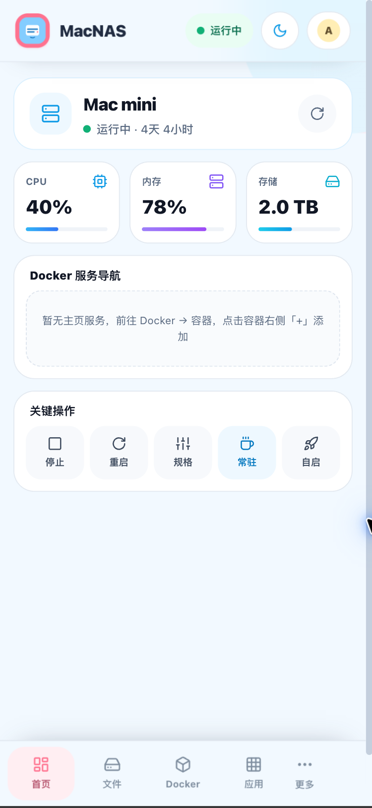
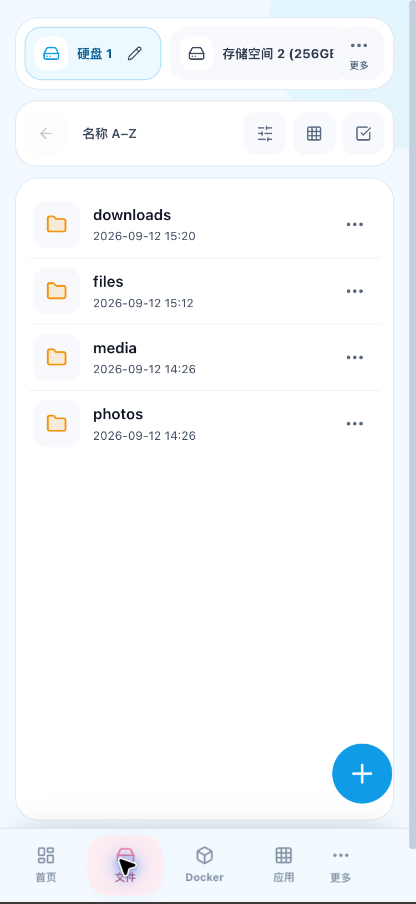
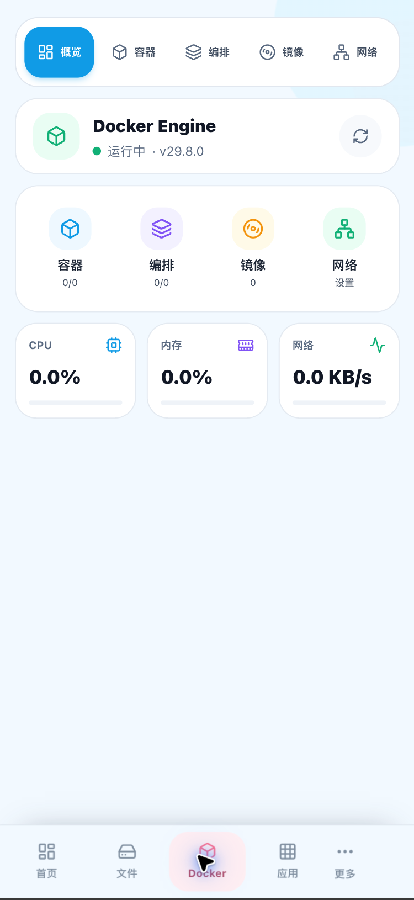
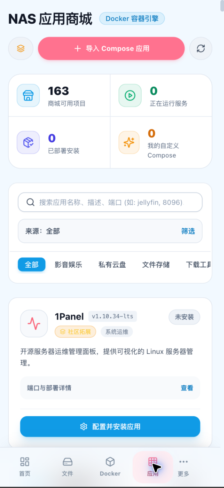
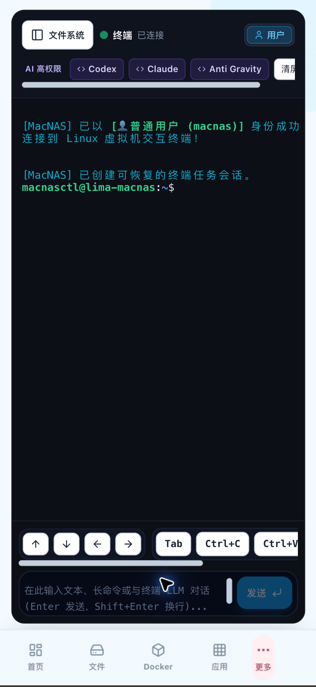
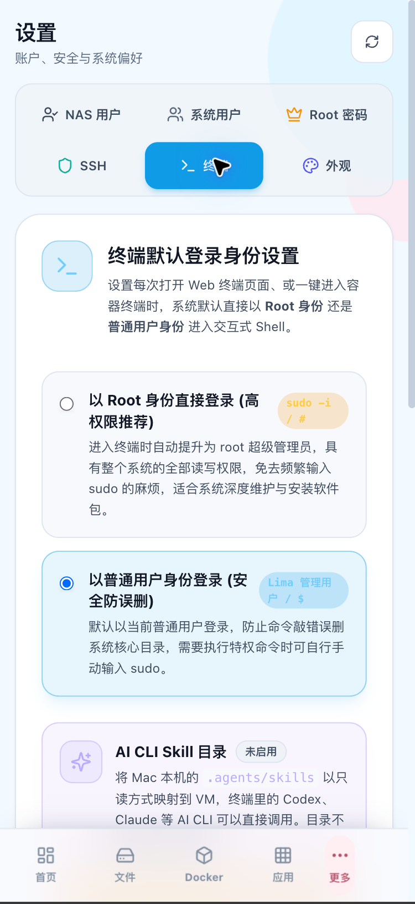

# MacBox

MacBox 是一个运行在 macOS 上的轻量级自托管服务中枢。它以 Web 控制台为主界面，通过 Lima Linux 虚拟机按需承载 Docker、文件管理、SMB 共享、云盘和 Web 终端；macOS 顶部菜单栏助手负责启动、停止、状态监控、日志和卸载。

MacBox 不追求成为一套大而全的家庭服务器系统：当前不提供 RAID/存储阵列、相册管理、媒体索引等能力。它的定位是一个开销尽量小的基础框架和控制面板，用户可以按需部署 Docker 服务，或直接在 VM 终端中安装自己的项目。

MacBox 采用 Apache License 2.0 发布，允许个人和组织商用、修改和再分发，具体条款见 [LICENSE](LICENSE)。

当前版本的分发方式是“预编译二进制压缩包 + `MacBoxMemu.app` + `install.sh`”，不提供 DMG。发行包不包含开发机用户、Docker 容器、Docker 镜像、卷、Lima 实例或 MacBox 数据。

## v0.1.0 当前版本功能（2026-09-13）

这是 MacBox 的第一个可用版本，重点完成“轻量运行、按需扩展、网页管理”的基础闭环：用户可以把一台闲置 Mac 变成文件中心、应用中心和开发工作台，并通过 VM 内终端继续安装自己的项目。

### 主要页面

以下截图来自当前运行版本，使用 MacBox 内置浏览器的手机视口生成。截图中的 CPU、内存、存储和文件名是测试环境数据。

<table>
  <tr>
    <td align="center"><br>首页：主机状态、资源监控、服务导航</td>
    <td align="center"><br>文件：磁盘、目录、收藏和文件操作</td>
  </tr>
  <tr>
    <td align="center"><br>Docker：容器、编排、镜像和网络</td>
    <td align="center"><br>应用：应用商城与 Compose 部署</td>
  </tr>
  <tr>
    <td align="center"><br>Web 终端：持久化会话与 AI CLI 快捷入口</td>
    <td align="center"><br>设置：终端身份与 AI CLI Skill 目录映射</td>
  </tr>
</table>

### 平台与启动管理

- Go 后端嵌入 React/Vite 前端，最终用户不需要安装 Node.js。
- Lima 提供 Linux 虚拟机，虚拟机内运行 Docker Engine、文件操作、SMB 和交互式终端。
- 首次启动状态机分为环境检查、虚拟机配置和服务启动阶段。
- 诊断中心检查 Lima、虚拟机、Mac 数据盘、MacBox 数据盘、SSH、Docker 和本机目录直通探针，并保留具体失败原因。
- 顶部菜单栏助手每 5 秒检测 Web 服务和资源状态，显示 CPU、内存、存储、Lima 和 Docker 状态。
- 菜单栏提供打开网页、启动/停止后端、启动/停止 Lima、刷新状态、打开日志，以及“仅卸载程序”和“彻底卸载”两级入口。

### 存储与文件管理

- 支持 MacBox 根目录、Docker 目录、第二存储空间和已挂载云盘等磁盘入口。
- 存储设置支持外置盘、本机目录直通、候选目录扫描、挂载契约和 VM 内可见性探针。
- 文件列表支持新建目录、上传、读取、重命名、复制、移动、删除、路径复制和下载。
- 常用目录可以收藏/取消收藏；收藏项在上方快速导航中显示，收藏星星使用黄色高对比度图标。
- 文件和文件夹都可以下载；文件夹会在服务端流式生成 ZIP，避免移动端依赖新窗口。
- 文件下载会先验证源文件和读取权限，避免浏览器创建 0 KB 空文件。
- 删除默认进入 `/data/.trash` 回收站，可恢复、清空；也支持从回收站安全移动到 Mac 本机 `~/.Trash`。
- 顶部任务列表显示云盘传输任务的状态、文件进度、总大小、当前文件和实时速度，并支持清理历史任务。
- 设置支持导出和恢复 MacBox 配置，第一版不包含备份密码，恢复前会保留必要的安全校验。

### 压缩与解压

- 当前仅支持 ZIP 压缩与解压。
- ZIP 使用虚拟机内 Python 标准库，开箱即用，不需要额外安装工具。
- 压缩包解压前会校验绝对路径、`..` 路径、控制字符、符号链接和特殊文件，降低路径穿越风险。

### Docker 与应用商城

- Docker 总览、容器、Compose 编排、镜像和网络页面。
- 容器支持启动、停止、重启、日志、删除；镜像支持拉取、删除和清理；Compose 支持查看、部署、启动、停止、重启、更新和删除。
- Compose 的宿主机 `ports` 会自动加入 Lima 端口转发白名单，新部署的服务默认可以通过 Mac 局域网 IP 访问，例如 `http://<Mac局域网IP>:8088`。
- 首页服务导航支持 Docker 服务与手动入口：Docker 服务与真实容器状态联动，手动入口只保存名称、地址和图标，不会影响实际服务。
- 手动服务入口支持添加、编辑、删除服务名称、访问地址和图标，适合登记通过终端或其他方式部署的服务。
- 容器右侧 `+` 可以自动读取容器名称和内网端口，选择 20 个预设图标后添加到首页；首页点击导航即可打开服务。
- 应用商城提供内置和社区 Compose 项目，可搜索、按分类筛选、查看端口/目录映射、配置并安装。
- 当前仓库包含 Dockge、File Browser、Jellyfin、Syncthing、qBittorrent、Alist、迅雷下载和百度网盘等模板；迅雷模板包含 `SYS_ADMIN` 与 `apparmor=unconfined` 配置。

### Web 终端与 AI CLI

- Web 终端支持可恢复的 Linux Shell 会话，页面刷新后仍能看到执行中的任务和历史输出。
- Docker 容器页面可以将最近日志填入终端输入框，用户确认后交给 AI CLI 分析；不会自动发送命令。
- 顶部提供 Codex CLI 快捷入口，点击后在终端中启动高权限模式：

  ```
  codex --yolo
  ```

- 在“设置 → 终端”中可以选择普通用户或 Root 默认登录身份。
- 支持配置 Mac 本机 AI Skill 目录：扫描 `~/.agents/skills`、`~/.codex/skills` 和 `~/.claude/skills`，经管理员确认后以只读方式映射到 VM 的 `/home/macboxctl/.agents/skills` 和 `/root/.agents/skills`。
- Skill 映射保存后需要重启 VM；AI CLI 和 Skill 本身需要用户预先安装并登录。

### 夸克云盘

- 文件页支持挂载夸克云盘，使用夸克官方扫码页面完成网页鉴权，不要求在 MacBox 中粘贴 Cookie、手机号密码或短信验证码。
- 挂载后作为独立云盘入口显示，可浏览目录、新建文件夹、重命名和删除云端文件。
- 支持下载单个文件、文件夹或多选项目到 MacBox 本地挂载目录，默认目标为 `/data/downloads`。
- 云盘下载在后台任务中执行，记录文件数量、总大小、完成字节数、当前文件、速度和失败原因；刷新页面后仍可查询。

## 安装与分发

### 首选：本地 Agent 源码部署

如果用户已经在这台 Mac 上安装了 Codex CLI、WorkBuddy 或其他具有本地终端权限的 Agent，发送下面这一句话，让 Agent 先获取源码再执行完整部署流程：

```text
请先执行 `git clone https://github.com/lulalulaluobo/macbox.git` 并进入仓库根目录，阅读根目录的 `MACBOX_DEPLOYMENT_PROMPT.md`，再严格按文档完成本地构建和部署，不要跳过检查或未经确认覆盖已有数据。
```

本地 Agent 需要能够在运行 MacBox 的 Mac 上执行终端命令；手机端聊天或没有本机权限的云端 Agent 不能替代本地部署。部署完成后，Agent 应返回实际安装目录、服务地址、Lima 状态和失败日志，而不是只报告“已完成”。

### 第二选择：直接使用 GitHub Release

建议将 Release 压缩包下载并解压到用户目录下的 `~/macbox`。该目录只是下载和解压工作目录，安装器会把程序安装到用户级运行目录。

从 GitHub Release 下载匹配架构的压缩包：

- Apple Silicon（M1/M2/M3/M4）：`MacBox_*_macos_aarch64.tar.gz`
- Intel Mac：`MacBox_*_macos_x86_64.tar.gz`

解压后直接双击根目录的 `MacBoxMemu.app`，然后从顶部菜单选择：

1. 启动后端服务；
2. 打开网页端；
3. 在本机完成首次初始化。

首次初始化只允许在运行 MacBox 的 Mac 本机完成。登录页会要求现场设置管理员用户名和至少 8 个字符的强密码，不使用公开固定账号密码。

如果 macOS 阻止未签名或未公证的开源 App：

1. 先校验 Release 的 SHA-256；
2. 在 Finder 中右键 `MacBoxMemu.app`，选择“打开”；
3. 如果仍被阻止，到“系统设置 → 隐私与安全性”点击“仍要打开”。

确认来源可信时，也可以只对当前发行包中的 App 移除隔离标记：

```
xattr -dr com.apple.quarantine "./MacBoxMemu.app"
open "./MacBoxMemu.app"
```

不要使用会全局关闭 Gatekeeper 的 `sudo spctl --master-disable`。

### 命令行备用安装

```
tar -xzf MacBox_*_macos_*.tar.gz
cd MacBox_*_macos_*
./install.sh --start
```

安装器会把程序安装到用户级目录 `~/.local/share/macbox`，并创建 `~/.local/bin/macbox`。它会检查 Lima：

- 已安装 Lima：直接复用；
- 已安装 Homebrew 但没有 Lima：交互式询问后执行 `brew install lima`；
- 没有 Homebrew：显示官方安装方式并停止，不静默执行远程脚本。

默认地址：

```
本机：http://127.0.0.1:19808
局域网：http://<Mac局域网IP>:19808
```

### 从源码构建

源码方式适合开发、调试和贡献，不是普通用户的默认安装路径。MacBox 源码仓库地址为 `https://github.com/lulalulaluobo/macbox`：

```
git clone https://github.com/lulalulaluobo/macbox.git
cd macbox
make release-mac
```

构建依赖 Go、Node.js/npm、Xcode Command Line Tools、Lima 和 macOS。构建脚本会：

1. 构建 React 前端；
2. 编译当前 macOS 架构的 Go 后端；
3. 复制 VM 模板、安装器、卸载器和备用控制器；
4. 编译 `MacBoxMemu.app`；
5. 生成压缩包、包内文件清单和 SHA-256 校验文件。

常用开发命令：

```
make build              # 构建前端并编译 bin/macbox
make dev-backend        # 仅本机访问的开发服务
make dev-backend-lan    # 局域网可访问的开发服务
make test               # 后端测试
```

## 局域网边界与安全说明

MacBox 当前定位是可信家庭局域网使用：默认使用 HTTP，外网访问需要用户自行配置 HTTPS/VPN/反向代理。HTTP 局域网模式不应直接暴露到公网。

当前已处理：

- 首次初始化仅允许本机完成，管理员密码由用户现场设置；
- API 默认拒绝未登记的 DNS Host，降低 DNS Rebinding 风险；
- AI Skill 映射使用只读挂载，并要求管理员二次确认风险；
- ZIP 解压执行路径和归档条目经过安全校验；
- 登录、上传并发和终端会话已有基础限制。

当前按内网产品边界暂缓：普通成员共享全部 MacBox 数据的细粒度 ACL、完整全局审计日志、完整供应链签名和公网级 HTTPS/限流。这些不代表 MacBox 已适合公网部署。

## 卸载与恢复初始状态

发行包中的菜单栏助手和卸载脚本区分两种操作：

```
./uninstall.sh                # 仅卸载程序，保留实例和数据
./uninstall.sh --purge        # 删除 MacBox 专属实例、镜像、配置和数据
./uninstall.sh --purge --uninstall-lima  # 同时卸载 Homebrew 安装的 Lima
```

破坏性清理需要输入 `DELETE` 确认，不会删除其他 Lima 实例、宿主机无关 Docker 数据或整个用户目录。

## 开源许可与致谢

MacBox 代码正式采用 **Apache License 2.0**，具体条款见仓库根目录的 [LICENSE](LICENSE)。

MacBox 的架构、功能边界和交互设计参考了以下优秀开源项目，感谢它们及其贡献者：

- [Lima](https://github.com/lima-vm/lima)（Apache-2.0）：macOS Linux 虚拟机、磁盘和端口转发思路。
- [Colima](https://github.com/abiosoft/colima)（MIT）：macOS 容器运行时的安装、检测和使用体验。
- [Dockge](https://github.com/louislam/dockge)（MIT）：Docker Compose 堆栈管理和实时日志交互。
- [CasaOS](https://github.com/IceWhaleTech/CasaOS)（Apache-2.0）：家庭服务器 Dashboard、应用导航和低门槛交互。
- [Cockpit](https://github.com/cockpit-project/cockpit)（包含 LGPL-2.1-or-later、GPL-3.0-or-later、BSD-3-Clause、MIT、CC-BY-SA-3.0 等）：存储状态抽象和服务器管理交互。
- [BigBear Dockge](https://github.com/bigbeartechworld/big-bear-dockge) 与 [BigBear CasaOS](https://github.com/bigbeartechworld/big-bear-casaos)：应用模板、Compose 配置和元数据组织方式。
- [copyparty](https://github.com/9001/copyparty)（MIT）：轻量文件服务、多协议共享和文件操作思路。
- [SFTPGo](https://github.com/drakkan/sftpgo)（AGPL-3.0-only，并带附加条款）：文件服务能力和存储后端抽象思路。
